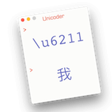
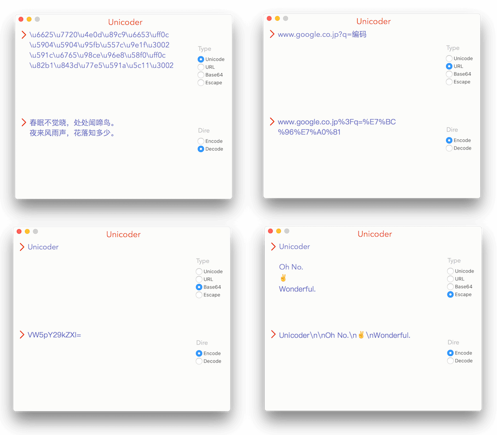

# Unicoder
Swift实现，Mac端字符串编码、解码小工具。

支持Unicode、URL(UTF8)、Base64、Escape的解码和编码。

这种小工具功能实现起来都不难，所以重要的是：“持续更新，优化体验，怎么方便怎么来”。

下载链接[在这里](http://7xl2dx.com1.z0.glb.clouddn.com/Unicoder.app.zip)。

这个小工具有自己的网站哦，欢迎来访。
http://unicoder.cn